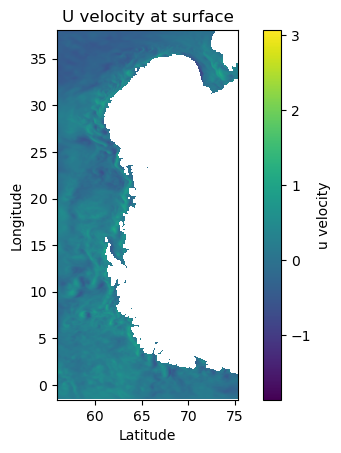

# CatOcean

The CatOcean project is a collection of tools and libraries for working with the MetOcean data.

The required libraries yet include:

- [numpy](https://numpy.org/)
- [pandas](https://pandas.pydata.org/)
- [xarray](https://xarray.pydata.org/)
- [dask](https://dask.org/)
- [netcdf4](https://unidata.github.io/netcdf4-python/)
- [h5py](https://www.h5py.org/)
- [hdf5](https://www.hdfgroup.org/hdf5/)

The goal of the project is to combine machine learning algorithms with the MetOcean data to embed with offshore engineering.